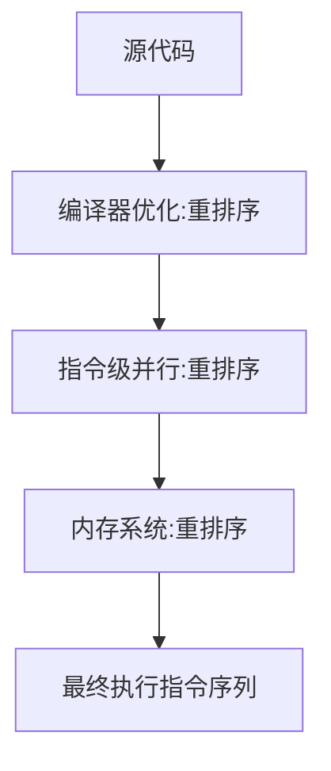

date: 2017-05-31 31:11:01
# 基础
## 并发编程模型分类
### 并发模型中的两个关键问题
1. 线程之间如何通信
2. 线程之间的同步
### 线程之间的通信机制
1. 共享内存
在共享内存的并发模型里，线程之间共享程序的公共状态，线程之间通过写-读内存中公共状态来隐式通信。
2. 消息传递
在消息传递的并发模型，线程之间没有公共状态，线程之间必须通过明确的发送消息来显式的通信
### 线程之间的同步机制
同步是指程序用于控制不同线程之间操作发生的相对顺序的机制。
1.共享内存
共享内存并发模型里，同步是显式进行的，程序猿必须显式的指定某个方法或某段代码需要在线程之间互斥执行。
2.消息传递
由于消息的发送必须在消息的接受之前，因此同步时隐式进行的
### java并发模型
java并发采用的是共享内存模型， java线程之间的通信总是隐式的，整个通信过程透明，所以编写多线程程序需要理解线程之间通信的工作机制

## java 内存模型的抽象
### 堆内存
堆内存是线程之间共享的 比如静态域，实例域，和数组元素 
**局部变量**，**方法定义参数**，**异常处理器参数** **不会**在线程之间共享

### JMM java内存模型
jmm决定了一个线程对共享变量的写入何时对另一个线程可见，
jmm定义了线程与主内存之间的抽象关系：
1. 线程之间的共享变量存储在主内存
2. 每个线程有自己的私有本地内存，是主内存共享变量的拷贝副本
3. 本地内存是一个抽象概念，并不真实存在
### jmm 抽象示意图
![java内存模型抽象示意图][1]
1. 线程a吧本地内存更新过的共享内存刷新到主内存
2. 线程b到主内存读取线程a更新过的共享变量
jmm通过控制主内存与每个线程之间本地内存之间的交互，来提供java线程之间的内存可见性保证
## 重排序
### 重排序的类型
1. 编译器优化的重排序
不改变单线程程序语义的前提下重新安排语句执行顺序
2. 指令级并行的重排序
先带处理器采用了指令级别的并行技术来将多条指令重叠执行，如果不存在数据依赖，处理器可以改变语句对应机器指令的执行顺序
3. 内存系统的重排序
由于处理器使用缓存和读/写缓冲区，这使得加载和存储操作看上去是乱序执行
```mermaid!
sequenceDiagram
源代码->> 编译器优化:重排序
编译器优化->> 指令级并行: 重排序
指令级并行->> 内存系统: 重排序
内存系统->> 最终执行指令序列
```

在重排序会导致多线程程序出现内存可见性问题，JMM属于语言级内存模型，只能保证不同编译器和不同处理器平台之上，通过禁止特定类型的编译器重排序和处理器重排序，保证一致的内存可见性
## 处理器重排序与内存屏障指令
cpu与内存交互中间有cpu二级和三级缓存作为缓冲区保证指令流水线持续运行，通过批处理的方式刷新写缓冲区，以及合并写缓冲区中对统一内存地址的多次写，可以减少对内存总线的占用，但是每个处理器的写缓冲区只对所在的处理器课件，正是这种缓冲区会对内存操作的执行顺序产生重要的影响： 处理器对内存的读写操作的执行顺序，不一定与内存实际发生的读写操作顺序一致，

| Processor A   | Processor B     | 
| --- 					| ---					 | 
|  a=1;x=b;   |   b=2;y=a  | 
|  初始状态： a=b=0;    |    
|    处理器允许重排序执行后得到结果：x=y=0    |  
![处理器与缓冲区交互，再刷新到内存导致的读写不一致][2]
由于a2操作可能发生在b3 操作之前 所以对导致 处理器a 读到的a=0 的值
为解决这种情况 java编译器会在生成智力序列的适当位置插入内存屏障指令来禁止特定类型的处理器重排序
有4种指令可以禁止重排序
StoreLoad Barriers  现代处理器都会支持，但该指令开销昂贵，会将缓冲区数据全部刷新到内存
## happens-before
jsr-133使用 happens-before的概念来阐述操作之间的内存可见性。在jmm中，如果一个操作执行的结果需要对另一个操作可见，那么这两个操作之间必须要存在happens-before关系。
1. 程序顺序规则: 一个线程中的每个操作，happens-before于该线程中任意后续操作即保证程序顺序执行
2. 监视器锁规则：对一个监视器的解锁，happens-before于随后对这个监视器的枷锁
3. volatile变量规则：对一个volatile域的写，happens-before 于任意后续对这个volatile域的读
4. 传递性：如果 A happens-before B ,且 B happens-before C ,那么A happens-before C
**注意：** 两个操作之间具有happens-before 关系 并不意味之第一个操作必须在后一个操作之前执行，仅仅是要求第一个操作的执行结果对后一个操作可见，且前一个操作按顺序排在第二个操作之前
![happens-before与jmm的关系图][3]


----

wanheming1991@gmail.com


  [1]: http://oq6m1y13p.bkt.clouddn.com/1496244465612.jpg
  [2]: http://oq6m1y13p.bkt.clouddn.com/1496247283806.jpg
  [3]: http://oq6m1y13p.bkt.clouddn.com/1496248314952.jpg